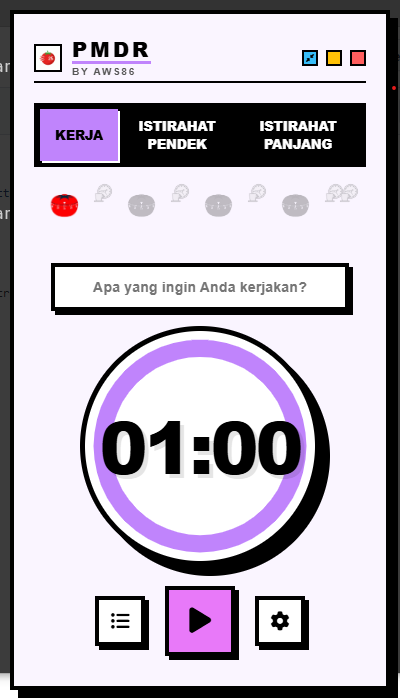

# PMDR — Pomodoro Apps By AWS86

A simple, clean, and effective **Pomodoro Timer Desktop App** built with **Electron.js**.
Designed to help users stay focused, manage tasks, and improve productivity with a minimal retro-modern interface.

---

## Preview

---

# Features

* ⏱️ Pomodoro focus timer
* ☕ Short break timer
* 🌙 Long break timer
* 📝 Task input / focus target
* ▶️ Start / pause session
* ⚙️ Settings menu
* 🎨 Minimal retro UI design
* 💻 Desktop application using Electron

---

# Tech Stack

* Electron.js
* HTML5
* CSS3
* JavaScript

---

# UI Concept

PMDR uses a:

* Retro pixel-inspired interface
* Minimal productivity layout
* Soft purple accent color
* Circular focus timer visualization

Perfect for:

* Students
* Programmers
* Office workers
* Anyone who wants distraction-free focus sessions

---

# Future Features

* 🔔 Notification sound
* 📊 Productivity statistics
* 🌙 Dark mode
* ☁️ Cloud sync
* 🎵 Background focus music
* 📅 Daily focus tracking

---

# Screenshot Design

Current interface includes:

* Work mode
* Short break mode
* Long break mode
* Circular countdown timer
* Task input box
* Minimal control buttons

---

# Author

**AWS86**

GitHub:
[AWS86 GitHub](https://github.com/yourusername?utm_source=chatgpt.com)

---

# License

This project is licensed under the MIT License.

---

# Support

If you like this project:

* ⭐ Star this repository
* 🍴 Fork this project
* 🛠️ Contribute improvements

---

> “Focus on being productive instead of busy.”
